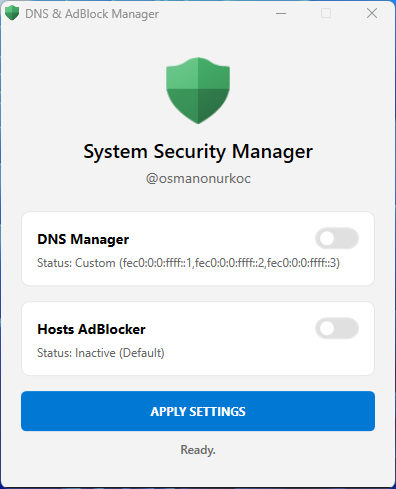
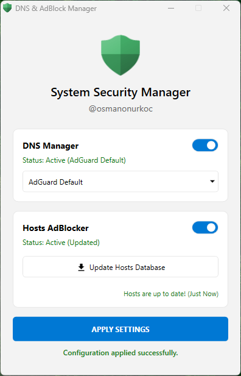
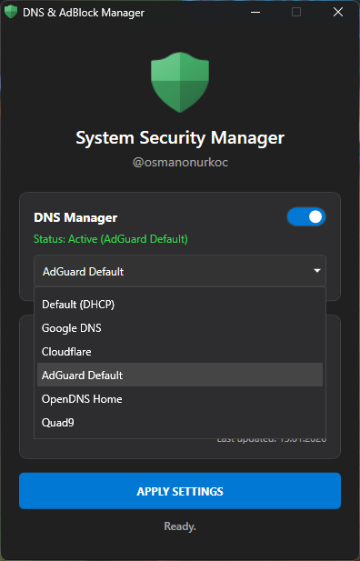
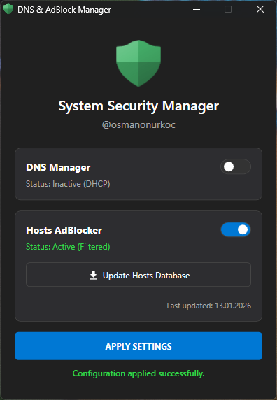

# 🛡️ System Security Manager (AdBlock & DNS Tool)

A lightweight, portable, and open-source PowerShell tool designed to enhance your system's privacy and security. It allows you to easily switch DNS providers and block advertisements/trackers system-wide using the Hosts file.

[](https://github.com/osmanonurkoc/AdBlockDNS/releases/latest)


## 📸 Screenshots

   
*The modern, dark/light-themed UI allowing quick DNS toggling and host file updates.*

## ✨ Features

- **🌐 DNS Manager:** - Quickly switch between popular DNS providers (Google, Cloudflare, Quad9, AdGuard, OpenDNS).
  - Easily revert to Default (DHCP) with a single click.
- **🚫 System-Wide AdBlocker:** - Blocks ads, trackers, and malicious domains by modifying the Windows `hosts` file.
  - Aggregates blocklists from trusted sources (StevenBlack, AdAway, Yoyo).
- **🧠 Smart Merge Logic:** - **Preserves your data:** If you have custom entries in your hosts file (e.g., for local development), this tool *will not* delete them. It only manages its own blocklist section.
- **🎨 Modern UI:** - Clean WPF-based Graphical User Interface.
  - **Auto-Theme:** Automatically adapts to your Windows Light or Dark mode settings.
- **📦 Portable:** - Single `.ps1` file. No installation required.

## 🚀 Getting Started

### Prerequisites
- **OS:** Windows 10 or Windows 11 (64-bit required).
- **Permissions:** Must be run as **Administrator** (required to modify Network settings and System files).

### Installation & Usage

#### Option 1: Using the Executable (Recommended)
1. Download the latest `AdBlockDNS.exe` from the **[Releases Page](https://github.com/osmanonurkoc/AdBlockDNS/releases/latest)**.
2. Double-click `AdBlockDNS.exe` to run.

#### Option 2: Running the Script (For Developers)
1. Download the source code.
2. Right-click `AdBlockDNS.ps1` and select **Run with PowerShell**.
   * *Note:* If you encounter an Execution Policy error, run this command in PowerShell once:
     ```powershell
     Set-ExecutionPolicy -Scope Process -ExecutionPolicy Bypass
     ```

## 🛠️ How It Works

1. **DNS Changer:** Uses native PowerShell commands (`Set-DnsClientServerAddress`) to change the DNS servers of your active network adapter.
2. **Hosts Blocker:** - Downloads raw text lists of ad-servers.
   - Parses and formats them into a Windows-compatible format.
   - Appends them to `C:\Windows\System32\drivers\etc\hosts` inside a tagged block.
   - Creates a backup (`hosts.bak`) automatically before the first run.

## ⚠️ Disclaimer
This tool modifies system files (`hosts`) and network settings. While it includes safety features (backups and smart merging), **use it at your own risk**. 
- Always ensure you have a system restore point if you are unsure.
- VPNs or other security software might conflict with DNS settings.

## 📄 License
This project is licensed under the [MIT License](LICENSE).

---
*Created by [@osmanonurkoc](https://github.com/osmanonurkoc)*
